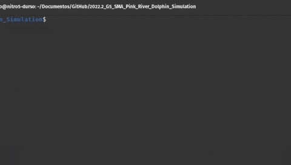
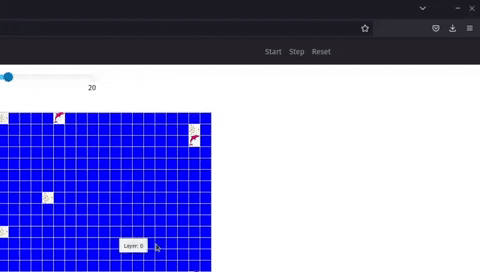
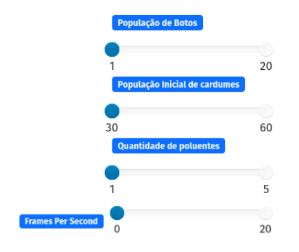

# Pink River Dolphin Simulation

**Disciplina**: FGA0210 - PARADIGMAS DE PROGRAMAÇÃO - T01 <br>

**Nro do Grupo**: 05<br>

**Paradigma**: Sistema Multiagentes<br>


## Alunos

| Matrícula | Aluno |
| -- | -- |
| 19/0142421  | Artur Vinicius Dias Nunes |
| 19/0085291  | Caio César Oliveira |
| 18/0123203 | João Pedro Alves da Silva Chaves |
| 18/0123459  | João Vitor de Souza Durso |
| 19/0128712  | Leticia Assunção Aires Moreira |
| 19/0111836  | Luan Vasco Cavalcante |
| 19/0044390  | Victor Rayan Adriano Ferreira |
| 19/0011602  | Christian Fleury Alencar Siqueira |

## Sobre 

O presente projeto foi desenvolvido durante a disciplina de Paradigmas de Programação do curso de Engenharia de Software da Universidade de Brasília com o intuito de aplicar conhecimentos adquiridos no módulo de Sistema Multiagentes.<br> <br>

Nesse sentido, seguindo a temática de animais em risco de extinção aplicada nas duas últimas entregas, decidimos desenvolver um sistema que simule as rotas migratórias do Boto Cor de Rosa, tendo como base determinadas complicações por nós estabelecidas, como a qualidade da água, a disponibilidade de comida e a presença de pescadores.

## Screenshots

### Tela inicial 
<p>


### Executando simulação
<p>


### Simulação em funcionamento
<p>


### Configurações adicionais
<p>


Como visto acima, você pode aumentar ou diminuir:
* A população de boto
* A população de cardumes
* A quantidade de poluentes
* Frames por segundo

## Instalação 
**Linguagens**: Python<br>
**Tecnologias**: Framework MESA<br>

### Pré-Requisitos

* Python 3
* Framework MESA
* Jupyter
* Matplotlib
* Numpy

### Instruções

1- Instalar [Python](https://www.python.org/);<br>
2- Instalar o Framework [MESA](https://mesa.readthedocs.io/en/latest/) e suas dependências, conforme [tutorial](https://mesa.readthedocs.io/en/latest/tutorials/intro_tutorial.html); <br>
````
pip install mesa
````
3- Clonar o presente repositório; <br>
````
git clone https://github.com/UnBParadigmas2022-2/2022.2_G5_SMA_Pink_River_Dolphin_Simulation.git
````
4- Usar o seguinte comando dentro do repositório:

````
python main.py
````
### E pronto, você já pode visualizar a simulação! <br>


## Participações

|Nome do Membro | Contribuição | Significância da Contribuição para o Projeto (Excelente/Boa/Regular/Ruim/Nula) |
| -- | -- | -- |
| Artur Vinicius Dias Nunes  | Adição da função de reprodução dos botos | Excelente |
| Caio César Oliveira | Contribuição no agente boto cor de rosa (Pink Dolphin), nas funções de caçar e comer o cardume. Além disso na função de caçar o boto no pescador e a função de pescar o boto em si | Excelente |
| João Pedro Alves da Silva Chaves | Adição da função que faz com que o boto fuja da água poluída e apoio na implementação dos agentes "pescador" e "água" |  Excelente |
| João Vitor de Souza Durso | Movimentação dos botos, do agente água, de pescar o boto e da reprodução dos botos.  | Excelente |
| Leticia Assunção Aires Moreira | Contribuição no agente boto cor de rosa (Pink Dolphin) em conjunto com o Caio. Implementação da função de movimentação do pescador, bem como a função de comer cardume e outras funcionalidades. Construção do README. | Excelente  |
| Luan Vasco Cavalcante | Movimentação dos botos. Implementação do agente água. Criação do Agente Poluente. Criação da função boto come cardume. | Excelente |
| Victor Rayan Adriano Ferreira | Slider de quantidade de cardumes iniciais, fugir da água com qualidade baixa, GUI. | Excelente |
| Christian Fleury Alencar Siqueira |  |  |

## Outros 
### Lições Aprendidas
|Nome do Membro | Lições Aprendidas | 
| -------- | -- | 
| Artur Vinicius Dias Nunes |  |  
| Caio César Oliveira | Além de aprender um pouco sobre a estrutura de modelagem baseada em agente Mesa, também aprendemos um pouco mais sobre orientação a objetos e trabalho em equipe.  |  
| João Pedro Alves da Silva Chaves | | 
| João Vitor de Souza Durso  | |  
|Leticia Assunção Aires Moreira  | Por meio da construção do projeto, foi possível aprender a respeito do sistema multiagentes mais na prática, já que a teoria me parecia um pouco distante e complexa. Além disso, pude praticar um pouco o python, já que utilizamos o MESA, o que facilitou bastante a implementação do jogo. | 
| Luan Vasco Cavalcante  |  |
| Victor Rayan Adriano Ferreira  | | 
| Christian Fleury Alencar Siqueira | |  

### Percepções
|Nome do Membro | Percepções | 
| -------- | -- | 
| Artur Vinicius Dias Nunes |  |  
| Caio César Oliveira | Paradigma é diferente do que estava acostumado a mexer, muito curioso como os objetos se conectam e interessante a capacidade de conseguir replicar situações da vida real em nível lógico, de forma simplificada claro. |  
| João Pedro Alves da Silva Chaves | | 
| João Vitor de Souza Durso  | |  
|Leticia Assunção Aires Moreira  | Senti que a curva de aprendizado do paradigma foi um pouco mais lenta que dos outros e pude perceber como a mudança em 1 agente influencia o comportamento dos outros agentes, de modo que os ajustes precisam ser sistêmicos. | 
| Luan Vasco Cavalcante  |  |
| Victor Rayan Adriano Ferreira  | | 
| Christian Fleury Alencar Siqueira | |  

### Fragilidades
|Nome do Membro | Fragilidades | 
| -------- | -- | 
| Artur Vinicius Dias Nunes |  |  
| Caio César Oliveira | Por algum motivo que o grupo não descobriu algumas vezes o pescador foca no lixo e não sai de perto dele. |  
| João Pedro Alves da Silva Chaves | | 
| João Vitor de Souza Durso  | |  
|Leticia Assunção Aires Moreira  | As funções desenvolvidas devem levar em consideração todos os outros agentes que podem ser impactados. Um exemplo disso é que, após implementar a busca do pescadore pelos botos, ele passa a se manter próximo do lixo. Contudo, antes de tal funcionalidade, o pescador se movimentava normalmente.  | 
| Luan Vasco Cavalcante  |  |
| Victor Rayan Adriano Ferreira  | | 
| Christian Fleury Alencar Siqueira | |  

### Trabalhos Futuros
|Nome do Membro | Trabalhos Futuros | 
| -------- | -- | 
| Artur Vinicius Dias Nunes |  |  
| Caio César Oliveira | Não sei se seria possível, mas utilizar os cenários gerados para os agentes irem aprendendo comportamentos por meio de machine learning. Dessa forma, qunato mais cenários fossem executados, melhor seriam os comportamentos dos agentes. |  
| João Pedro Alves da Silva Chaves | | 
| João Vitor de Souza Durso  | |  
|Leticia Assunção Aires Moreira  | Uma possível melhoria é a redução da dispersão do esgoto. | 
| Luan Vasco Cavalcante  |  |
| Victor Rayan Adriano Ferreira  | | 
| Christian Fleury Alencar Siqueira | |  

## Vídeo

## Referências

> KAZIL, Jackie; MASAD, David; ANDREW, Crooks. Utilizing Python for Agent-Based Modeling: The Mesa Framework. Cham: Springer International Publishing, 2020. Disponível em: https://mesa.readthedocs.io/en/stable/. Acesso em: 20 jan. 2023.

> Session 9A Lecture : Agent Based Simulation using MESA. Disponível em: https://www.youtube.com/watch?v=VeQkhfDYyMc. Acesso em: 20 jan. 2023.

> Grimm, Volker, Eloy Revilla, Uta Berger, Florian Jeltsch, Wolf M. Mooij, Steven F. Railsback, Hans-Hermann Thulke, Jacob Weiner, Thorsten Wiegand, and Donald L. DeAngelis. 2005. “Pattern-Oriented Modeling of Agent Based Complex Systems: Lessons from Ecology.” American Association for the Advancement of Science 310 (5750): 987–91. doi:10.1126/science.1116681.

> Hunt, Andrew, and David Thomas. 2010. The Pragmatic Programmer: From Journeyman to Master. Reading, Massachusetts: Addison-Wesley.

> Leek, Jeffrey T., and Roger D. Peng. 2015. “Reproducible Research Can Still Be Wrong: Adopting a Prevention Approach.” Proceedings of the National Academy of Sciences 112 (6): 1645–46. doi:10.1073/pnas.1421412111.
